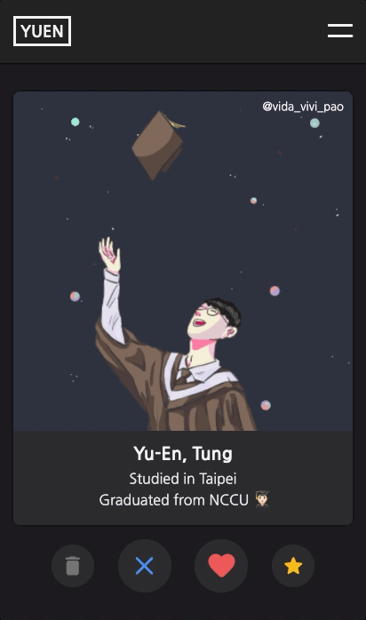

本專案環境是透過 [Create React App](https://github.com/facebook/create-react-app) 所建立。

# YUEN's Website
這是一個關於我的網站，主要使用 React 與 Redux 作為開發工具。如有興趣，可至 https://yuentung.github.io/ 查看線上版本。

<div>
    
    
</div>

## 啟動專案
```shell
$ git clone https://github.com/yuentung/yuentung.github.io.git
$ cd yuentung.github.io
$ npm install && npm start (或使用 yarn && yarn start)
```

## 專案架構
以下主要針對 src 資料夾做介紹：
```
src
├── components
│   └── atoms
│   └── molecules
│   └── organisms
│   └── templates
│   └── App.js
├── constants
│   └── data.js
│   └── color.js
│   └── media.js
├── images
├── actions
├── reducers
└── index.js
```
依照不同功能及需求創建資料夾與檔案：
- `/components`：放置所有元件，並以 `原子設計` 的方式進行管理
- `/constants`：放置所有 `不會更改` 的資訊，包含：
    - `data.js`：存放 `中/ 英文語系` 所對應的各種資訊
    - `color.js`：存放 `日/夜間模式` 所對應的各個色號
    - `media.js`：存放所有 media query 語句
- `/images`：放置所有圖片
- `/actions`：放置所有 actions
- `/reducers`：放置所有 reducers
- `index.js`：為本專案的 entry point

## 使用工具
- [React](https://reactjs.org/)

    以 React 中兩大主要概念建構專案，分別是：

    - 元件(component)：將 UI 拆分成一個個元件，進而更容易重用(reuse)程式碼
    - 狀態(state)：各個元件依照狀態的不同建構出對應的 UI

    進而達到方便開發、維護及擴充的目的。

- [Redux](https://redux.js.org/)

    由於專案中許多元件會隨著以下兩種狀態的不同而改變，分別是：

    - 日/夜間模式：隨著模式的不同，調整對應的 `樣式`
    - 中/英文語系：隨著語系的不同，調整對應的 `文案`

    所以選擇將其統一放置於 store 中管理，以便各元件進行存取。

- [Redux Thunk](https://github.com/reduxjs/redux-thunk)

    為了於使用者調整 `日/夜間模式` 與 `中/英文語系` 時，將其結果紀錄於 Local Storage 中，進而達成 `再次進入網頁時保有過去設定` 的效果，而使用 Redux Thunk 作為 middleware，以進行額外的處理。

- [styled-components](https://styled-components.com/)

    透過 styled-components 以 CSS-in-JS 的方式建立附帶樣式的 React 元件，除了能夠以熟悉的撰寫方式設定 CSS 取代 Inline Style 中 style 物件的寫法外，還可以透過 props 對各元件進行客製化的設定。此外，搭配 ThemeProvider 的使用，將當前 `日/夜間模式` 所對應的樣式傳遞至所有 styled 元件中，方便進行樣式管理。

- [React Tinder Card](https://github.com/3DJakob/react-tinder-card)

    使用 React Tinder Card 快速建立可滑動的卡片，以達成猶如在交友軟體上瀏覽資訊的效果。

## 未來發展
- [ ] 持續優化使用者體驗，包含 UX 及網頁效能
- [ ] 持續新增網頁內容
- [ ] 建立後台以方便調整前台資訊